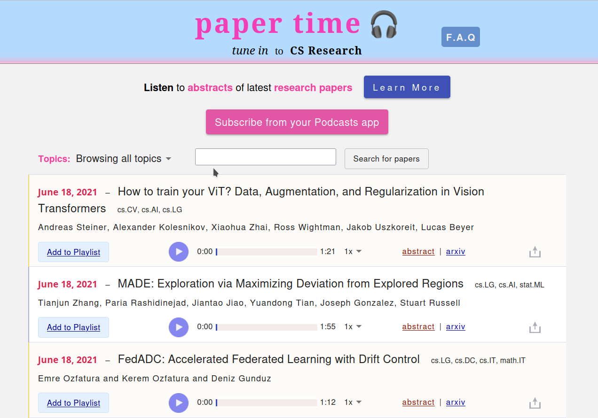

paper-app
=======
Webapp for listening to paper abstracts from [Arxiv](https://www.arxiv.org). See sample screenshot below  



### To compile
$ mvn clean package

### To run locally
This launches the web app using a Postgres instance running within docker,
seeded with some static data. 
```
$ (Optional) export GOOGLE_APPLICATION_CREDENTIALS=/path/to/google-app-creds.json
$ mvn spring-boot:run -Dspring.profiles.active=dev
```

### To deploy to server  
See file deploy-het.sh

### (Deprecated) To deploy to Google App Engine  
* Just push your changes to the prod-deploy branch on the Github repository. And a new build
will be pushed to the Google App Engine.
 
This relies on the Github Actions feature. The config file is .github/workflows/deploy.yaml.
A "secrets" file is referenced there, which can be found in this repo's Settings > Secrets
on the Github UI. 

Alternately:  
$ gcloud app deploy  
URL etc will printed on the console. Follow the instructions.

### To view logs  
$ gcloud app logs tail -s default  

### To understand the build 
$ mvn buildplan:list-phase  
OR  
$ mvn buildplan:list  
OR  
$ mvn buildplan:list-phase -Dbuildplan.phase=test   

### To stop the app
1. Go to Google Cloud Console
1. Go to Settings for this app and click Disable Application.

### References
1. Adding both Spring and React to the same app:
https://medium.com/@itzgeoff/including-react-in-your-spring-boot-maven-build-ae3b8f8826e
